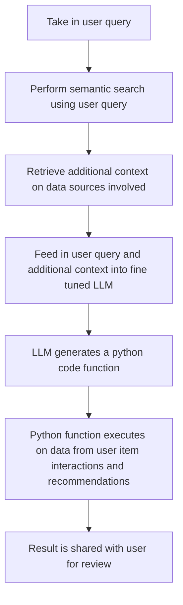

# LLM_CRM_PERSO
Personalized Customer Relationship Management System using Large Language Models

*Leveraging AI for Efficient Customer Relationship Management (CRM) and Effective Digital Asset Management (DAM)* 

The project will aim to investigate the potential of enhancing the efficacy of Customer Relationship Management (CRM) users and accomplishing successful campaigns through the integration of a text-based search and command oriented Artificial Intelligence (AI) solution with the digital assets currently at the disposal of the organization. The proposed solution would facilitate the reuse of extant digital assets, such as product feature repository, customer features including customer lifetime value (CLV), images, brands, etc., in situations where they are applicable and produce a ranking based interconnections for better understanding the customer perspective, and necessitate the creation of new assets solely in cases where the requisite assets are not available. Consequently, the cost of generating novel digital assets would be significantly reduced, which would otherwise prove to be a formidable task in the face of the continuously expanding volume of digital assets. 

The integration of AI with CRM systems is an emerging trend that has garnered significant attention in recent years. However, there is still much room for improvement in terms of effectively harnessing the potential of AI for enhancing CRM efficiency. The proposed solution presents a unique approach towards this end, which is not yet widely adopted. The project intends to offer a novel way of addressing a critical challenge faced by many organizations, i.e., the growing volume of digital assets and effectively using it for maximising business benefit. The solution aims to facilitate the reuse of existing digital assets wherever applicable, thereby reducing the need for creating new assets and consequently reducing the associated costs. The successful implementation of such a project has the potential to deliver significant benefits to organizations, such as improved efficiency, reduced costs, and enhanced ROI. As such, it presents a compelling case for further exploration and implementation. In future the idea can be extended towards content personalization that would enable organizations to deliver more engaging and personalized content experiences to customers by re-purposing the digital assets for each customer based on their preferences and interests, thereby improving customer satisfaction and loyalty, and driving business growth.

To implement the proposed project, the digital assets such as product categories, images, details, etc. need to be analysed and converted into ranked based scores based on the customer interactions. It would be possible to identify and extract relevant information, such as product features, attributes, and specifications, and represent them in a structured format that can be easily queried by AI (NLP, LLMs) models. This would enable the development of more sophisticated language models that can provide more context-based responses when a CRM user queries about a product, colour, design, category, and other related topics such as why not try a new category, next best purchase option and recommendation, etc.

## High Level Process Flow Diagram

##### References:

- https://mermaid.js.org/intro/getting-started.html

## Recommendation System

### Overview

Here it contains notebooks detailing the development process of a recommendation system for retail business. The project aims to construct a robust recommendation model leveraging data preprocessing, synthetic data generation, and deep learning techniques.

### Notebooks

#### Notebook 1: Data Preparation [10_data_preparation.ipynb](https://github.com/nayan4qmul/LLM_CRM_PERSO/blob/main/scripts/10_data_preparation.ipynb)

In this notebook, data from the Olist e-commerce platform is loaded and prepared. The following steps are executed:

- Extracting relevant columns from orders and customers datasets.
- Merging datasets based on customer ID.
- Loading order items and order reviews datasets, aggregating order items and calculating average review scores per order.
- Loading products dataset and translating product category names.
- Merging product information with order data and generating SKUs for product categories.
- Rearranging columns and exporting cleaned dataset to a CSV file.

##### References:

- https://medium.com/codex/tensorflow-deep-learning-recommenders-on-retail-dataset-ce0c50aff5fa

- Source Dataset Citation - Olist, and André Sionek. (2018). Brazilian E-Commerce Public Dataset by Olist [Data set]. Kaggle. https://doi.org/10.34740/KAGGLE/DSV/195341

#### Notebook 2: Synthetic Data Generation [20_create_synthetic_data.ipynb](https://github.com/nayan4qmul/LLM_CRM_PERSO/blob/main/scripts/20_create_synthetic_data.ipynb)

This notebook demonstrates the process of generating synthetic transaction data using the sdv library in Python. Key steps include:

- Loading original transaction data into a DataFrame.
- Creating metadata using SingleTableMetadata class from sdv.
- Synthesizing new data using GaussianCopulaSynthesizer with constraints.
- Evaluating synthetic data quality and comparing it with the original dataset.
- Generating consistent primary key generation like order IDs.
- Saving synthetic transaction data to a CSV file.

##### References:

- SDV is a public, source-available Python library for generating and evaluating synthetic data. You can download and use it under the Business Source License.

License: https://github.com/sdv-dev/SDV/blob/main/LICENSE

#### Notebook 3: Recommendation System Development [30_auto_DCN.ipynb](https://github.com/nayan4qmul/LLM_CRM_PERSO/blob/main/scripts/30_auto_DCN.ipynb)

This notebook focuses on building recommendation systems using collaborative filtering and deep learning techniques. Key steps involved are:

- Preprocessing transactional data, scaling, and transforming interactions for modeling.
- Creating TensorFlow datasets and defining models for collaborative filtering and a Deep & Cross Network (DCN).
- Training and evaluating models using different configurations, monitoring metrics like RMSE on validation sets.
- Selecting the best-performing model based on evaluation results.
- Visualizing RMSE of different models across various interaction volumes.
- Evaluating the best model's performance on a test set and analyzing predictions.
- Plotting RMSE versus the number of interactions and analyzing performance trends.

##### References:

- https://www.tensorflow.org/recommenders/examples/dcn

- https://arxiv.org/pdf/2008.13535.pdf

### Execution Order

The notebooks need to be executed in the following order:

1. Data Preparation (Notebook 1)
2. Synthetic Data Generation (Notebook 2)
3. Recommendation System Development (Notebook 3)

### Important Considerations

- Ensure notebooks are executed sequentially to maintain dependencies.
- Evaluate synthetic data quality before use to ensure fidelity.
- Consider resource constraints, particularly regarding memory usage, during model training and complexity decisions.
- Explore alternative evaluation metrics or techniques for performance enhancement.
- Keep in mind the focus of the project on building a prototype using ranking scores as a representational substitute of digital asset management artifacts.

## Text to Python Code Generation

### Custom dataset preparation Guide:

This guide provides step-by-step instructions for preparing a custom dataset for use in projects involving CRM (Customer Relationship Management) user queries and various data sources such as customer master, product master, user and item interaction, etc.

#### Dataset Columns

The custom dataset should have at least the following columns:

- **Question (or Query)**: End-user queries directed towards the system. These queries originate from CRM users seeking insights from data sources.
  
- **Context**: Additional information about the database and its contents. This provides background or contextual information necessary to understand the queries and provide the solutions accordingly.
  
- **Solution (or Original Answer)**: Python functions that, when executed on the databases, provide the necessary information to fulfill user queries. Solutions may include in-line comments or docstrings for clarity and documentation purposes.

#### Steps to Prepare the Dataset

1. **Gather Questions**: Collect a set of questions or queries that represent typical inquiries made by CRM users. These queries should cover a range of scenarios and topics relevant to the CRM system and transactional databases.

2. **Provide Context**: For each question, provide context about the databases and their contents. This may include descriptions of database schemas, data tables, key entities, and relevant business rules or processes.

3. **Create Solutions**: Develop Python functions that, when executed on the databases, retrieve the necessary information to address the queries effectively. These functions should be designed to handle the specified queries and provide accurate results. Include in-line comments or docstrings within the functions to explain their functionality and usage.

4. **Prepare the Dataset Files**:

   - [CRM_data.csv](https://github.com/nayan4qmul/LLM_CRM_PERSO/blob/main/data/CRM_data.csv) (with Comments): CSV file containing the prepared dataset, including comments within the solution column for additional insights into the logic and implementation of the Python functions.
   
   - [CRM_data_no_comments.csv](https://github.com/nayan4qmul/LLM_CRM_PERSO/blob/main/data/CRM_data_no_comments.csv) (Without Comments): Optionally, a second CSV file containing the dataset without comments in the solution column, suitable for scenarios where comments are not required.

#### Validation and Training

- The script [40_validate_custom_data.ipynb](https://github.com/nayan4qmul/LLM_CRM_PERSO/blob/main/scripts/40_validate_custom_data.ipynb) helps in validating the functions captured in the custom dataset files.

- The script [50_message_data_preperation.ipynb](https://github.com/nayan4qmul/LLM_CRM_PERSO/blob/main/scripts/50_message_data_preperation.ipynb) aids in creating the training (80%), validation (10%), and testing (remaining) datasets, stored in JSON format:
  - [train_CRM_data.json](https://github.com/nayan4qmul/LLM_CRM_PERSO/blob/main/data/train_CRM_data.json): Training dataset
  - [val_CRM_data.json](https://github.com/nayan4qmul/LLM_CRM_PERSO/blob/main/data/val_CRM_data.json): Validation dataset
  - [test_CRM_data.json](https://github.com/nayan4qmul/LLM_CRM_PERSO/blob/main/data/test_CRM_data.json): Test dataset

#### Model Fine-tuning

- The script [60_finetune_mistral.ipynb](https://github.com/nayan4qmul/LLM_CRM_PERSO/blob/main/scripts/60_finetune_mistral.ipynb) is used to fine-tune the Mistral AI model for better generating Python functions based on the given user questions and contextual information around available data sources and assets.

##### References:

- https://github.com/brevdev/notebooks/blob/main/mistral-finetune-own-data.ipynb

- https://arxiv.org/abs/2106.09685v2 This is a lossy method but established to provide quite good performance

#### Reports

- [01_finetune_mistral](https://api.wandb.ai/links/nayan4learn/trqkrrp8)

##### Other References

1. Implementation : https://www.philschmid.de/fine-tune-llms-in-2024-with-trl
2. .gitignore : https://github.com/github/gitignore/blob/main/Python.gitignore
3. sanitized-mbpp.json : https://github.com/google-research/google-research/tree/master/mbpp
4. english_python_data.txt : https://github.com/divyam96/English-to-Python-Converter/blob/main/README.md

#### Model RAG (Semantic Search) Inferencing

- The script [70_semantic_search_RAG_inference.ipynb](https://github.com/nayan4qmul/LLM_CRM_PERSO/blob/main/scripts/70_semantic_search_RAG_inference.ipynb) demonstrates the implementation of Retrieval-Augmented Generation (RAG), a technique that enhances text generation by leveraging semantic search to retrieve relevant context from a large database. The integration of semantic search enables the model to produce more accurate and contextually appropriate text outputs. The iterative error handling strategy used in the notebook shows progressive accuracy improvement across passes, indicating effectiveness; however, residual errors suggest potential model limitations and underscore the need for continued refinement.

##### References:

- https://www.sbert.net/examples/applications/semantic-search/README.html

- https://www.sbert.net/docs/pretrained_models.html

- https://paperswithcode.com/sota/code-generation-on-humaneval

## E-2-E system implementation

### Overview

The system analyses its digital footprint, and considers recommendations leveraging DCN networks for performance enhancement. The system processes transaction data, standardizes ratings, and calculates interaction scores, subsequently categorizing them and generating unique order IDs. Additionally, it provides functions for user query processing, response generation, and code execution. While exhibiting resilience in error handling and satisfactory response generation, there's room for improvement in code efficiency and user experience, particularly in response time and error management. Nonetheless, the system demonstrates capability in answering queries and deriving insights from data sources.

### Notebook

[80_crm_perso_ai.ipynb](https://github.com/nayan4qmul/LLM_CRM_PERSO/blob/main/scripts/80_crm_perso_ai.ipynb)

The notebook considers representation of the actual digital footprint within the organisation including accurate recommendations from DCN networks for better performance, user experience and asset management. Here in particular, the code essentially processes transaction data, aggregates interactions, standardizes ratings, calculates scores, and prepares the data for downstream analysis. It then uses various functions collectively that enables the system to process user queries, generate responses, and execute generated code to provide desired functionality.

The actual execution of the system provides valuable insights into its performance, strengths, and areas for improvement.

1. There's noticeable variation in response times across different queries. Some queries had a relatively quicker response time compared to others. Even the execution efficiency varies for different types of queries.
2. The system demonstrates resilience in error handling, as seen in some of the query responses. Despite encountering errors during execution, the system attempted to recover and provide a response. This ability to handle errors gracefully enhances the user experience and reliability of the system. One potential option may be feed in the errors observed from various responses as an active learning material. When the system encounters errors in responses, we can use these mistakes as learning opportunities. By feeding these errors back into the training process, the system can learn from them and improve its ability to handle similar situations in the future. This helps the system get better at answering questions, especially when it doesn't have a lot of data to learn from initially.
3. The model's performance in generating responses appears satisfactory overall. It successfully generates Python function definitions in response to user queries, which align with the expected functionality. However, there may be room for improvement in refining the generated code to be more concise and efficient.
4. The user experience is affected by factors such as response time and error handling. While faster response times contribute to a smoother user experience, longer delays or errors may lead to frustration or dissatisfaction. Improvements in performance and error handling mechanisms could enhance the overall user experience.
5. The system can answer general and simple question that it has not seen earlier explicitly. It can effectively perform derivations from the given data sources. Currently it lacks the ability to answer multiple queries in one question and responses to the first query only. However, it can still handle all the questions if asked one by one separately.
6. With the help of additional resources, the current implementation can be extended to produce the response in a conversational format by persisting the historical responses from the past system interaction automatically thereby enhancing further the user experiences.
